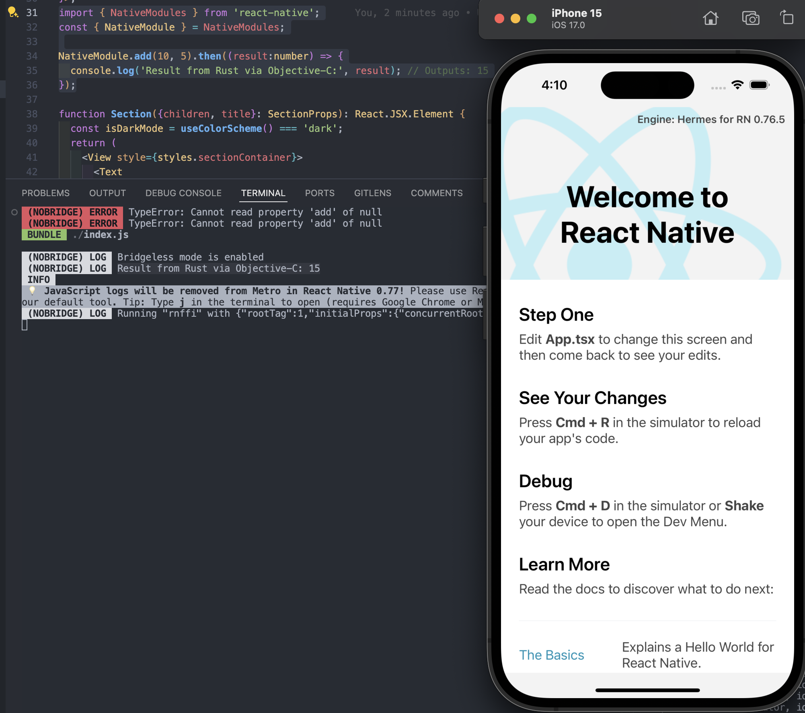

# Getting Started

>**Note**: Make sure you have completed the [React Native - Environment Setup](https://reactnative.dev/docs/environment-setup) instructions till "Creating a new application" step, before proceeding.

## Step 1: Start the Metro Server

First, you will need to start **Metro**, the JavaScript _bundler_ that ships _with_ React Native.

To start Metro, run the following command from the _root_ of your React Native project:

```bash
# using npm
npm start

# OR using Yarn
yarn start
```

## Step 2: Start your Application

Let Metro Bundler run in its _own_ terminal. Open a _new_ terminal from the _root_ of your React Native project. Run the following command to start your _iOS_ app:

### For iOS

```bash
# using npm
npm run ios

# OR using Yarn
yarn ios
```

If everything is set up _correctly_, you should see your new app running in your _iOS Simulator_ shortly provided you have set up your simulator correctly.

## Code in action
- You can see the calling from react native to rust, and rust to return a value back to react native as the terminal log below.
- The related code are found in this commit https://github.com/roti-c137/react-native-ffi/commit/6c7b7ca473e910f10c5e3598780c32760ab08ac0


